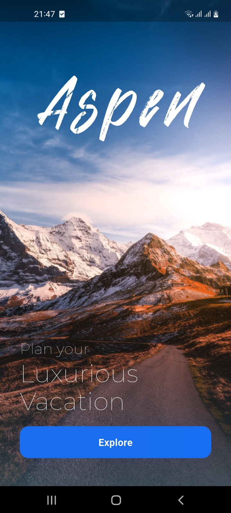
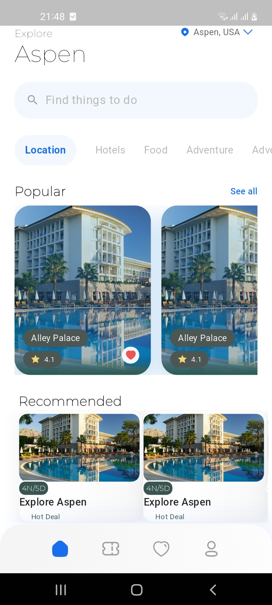
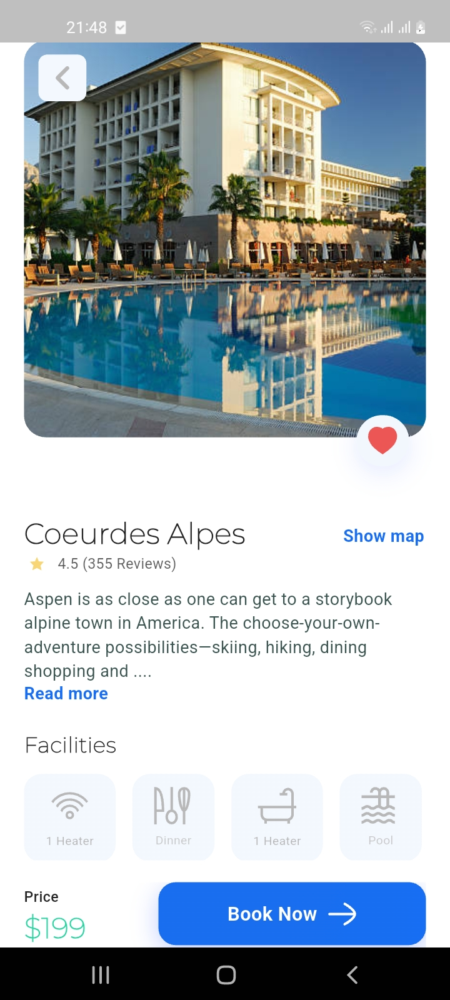

# 🏨 Hotel Booking App (Flutter)

A modern and elegant **Hotel Booking App** UI built with **Flutter**, inspired by the beautiful [Figma design](https://www.figma.com/community/file/1091615514005406765). 


---

## ✨ Preview

> 📲 Below is the original design reference that inspired this Flutter implementation:


---


## 📸 Screenshots

| Start Screen | Home Screen | Hotel Details |
|--------------|-------------|----------------|
|  |  |  |


---

## 📦 Installation

```bash
# 1. Clone the repo
git clone https://github.com/yourusername/hotel_booking_app.git
cd hotel_booking_app

# 2. Get dependencies
flutter pub get

# 3. Run the app
flutter run
